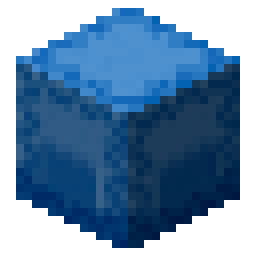

<div align="center">



# CodeCraft

**A thin panel pinned to the top of your screen, so you always know what your AI coding assistants are doing.**

A lightweight desktop workbench focused on AI coding sessions · Built for Windows

<p>
  
  
  
  
</p>

[简体中文](README.md) · **English** · [繁體中文](README.zh-TW.md)

</div>

---

## What is this?

If you use AI coding assistants like **Claude Code**, **Codex**, **OpenCode**, **PI**, **DeepSeek Harness**, or **ZCode**, you have probably run into this:

- You hand it a task, then sit there staring at a black terminal window with no idea whether it has finished;
- Halfway through it asks "can I run this command?", you don't notice, and it just waits forever;
- You start several tasks at once, and once the windows pile up everything falls apart.

CodeCraft exists to fix that. Most of the time it's just an almost invisible sliver at the very top of your screen. Hover over it and it expands into a list of cards: who's busy, who's stuck, who needs you to click "approve" — all at a glance. Once you're done, it tucks itself away again.

> In short: **it's a dashboard and doorbell for your AI assistants**, not another code editor.

## What it does for you

| | Capability | Details |
| :---: | --- | --- |
| 📋 | **All sessions in one place** | Tasks from Claude Code, Codex, OpenCode, PI, DeepSeek Harness, and ZCode side by side, with status at a glance: working, waiting for input, needs attention, done, failed. |
| ✅ | **One-click approval** | When an assistant wants to run a command or edit a file, the request pops up on the panel. Click "Allow once", "Always allow", or "Deny" — no need to switch back to the terminal. |
| ❓ | **Answer on its behalf** | When an assistant asks a question, pick an option or type a note right in the panel, and the answer is sent back to it. |
| 📝 | **Confirm plans** | Once an assistant lays out its plan, you decide: click "Run plan" to let it start, or write down what to change so it revises first. |
| 🔔 | **Sound alerts** | Four built-in sound packs — music box, cat, bone, XP — or bring your own audio. Step away from the desk and you still won't miss a request. |
| 📱 | **Check from your phone** | Turn on the LAN console, scan the QR code from your phone's browser to view sessions, and even approve remotely (off by default). |
| 🎨 | **Make it yours** | Dark / light theme, three opacity levels, global scaling, animation toggle, custom "work block" image. |
| 🌏 | **Three languages** | Simplified Chinese, Traditional Chinese, and English, switching takes effect instantly. |

## Supported agents

CodeCraft doesn't write code itself — it watches the AI coding assistants below. Once you've installed the matching connection (step 2 in the next section), their tasks show up on the panel.

| Agent | Notes |
| --- | --- |
| &nbsp; **Claude Code**<br /><sub>Anthropic</sub> | The most complete support. Session status, tool calls, and live transcripts are all visible, and approvals, answering questions, and confirming plans can all be done right in the panel without returning to the terminal. |
| &nbsp; **Codex**<br /><sub>OpenAI</sub> | Session status and tool-call approvals can be handled in the panel. Its questions and plan confirmations are read-only and must be completed back in the original Codex window; the panel offers a jump button to get you there. |
| &nbsp; **OpenCode**<br /><sub>opencode.ai</sub> | Session status, tool calls, native permission approvals, and questions can all be handled in the panel. Permission decisions support "Allow once", "Always allow", and "Deny", plus an optional all-tool gate mode that routes every tool call through you first. Plan confirmation isn't wired up yet and must be completed back in the OpenCode window. |
| **PI** | Sessions, tool activity, permissions, and questions are available in the panel and LAN console. It supports allow once, allow for the session, and deny; plan review is not connected yet. |
| &nbsp; **DeepSeek Harness**<br /><sub>DeepSeek</sub> | A user-level native plugin synchronizes sessions, responses, tool activity, questions, and plan review. Permissions follow DSH's one-shot semantics, so only "Allow once" and "Deny" are offered. Plans can be approved or returned with feedback for further planning. |
| **ZCode**<br /><sub>Z.ai</sub> | The official seven-event Hook synchronizes external Desktop/CLI sessions, tool results, final answers, questions, and plan review. Ordinary tools offer only "Allow once" and "Deny"; questions and plans always require a person, even in automatic mode. |

All six agents can run at the same time. The filter buttons at the top of the panel let you look at just one of them, or "All" together.

> DeepSeek Harness is currently a Developer Preview. CodeCraft primarily targets `@deepseek-ai/dsh@0.1.1-rc.2` and also supports `0.1.2-alpha.2`; the local bridge rejects interactions when the runtime version is unknown or outside this compatibility list.

## Getting started

**1. Install and launch**

Run the installer, then start CodeCraft. It won't appear in the taskbar — move your mouse to the **top center** of your primary display, and that thin line is it.

**2. Connect your AI assistant (the key step)**

Expand the panel → click ⚙️ in the top right → **General → Hook management** → click the agent you want to connect.

What does this do? CodeCraft adds a "notification hook" to that assistant's configuration so it proactively tells CodeCraft when it starts working, wants to call a tool, or finishes a task. Without it, the panel stays empty. You can uninstall from the same place at any time, and your configuration is restored.

DeepSeek Harness uses `cordis.patch.yml` and a local ESM plugin under `$DSH_HOME` (default `~/.dsh`). CodeCraft only manages its marked configuration block, writes `.bak` files before changes, and preserves other plugins and overlay entries during uninstall.

ZCode uses the user-level `~/.zcode/cli/config.json`. CodeCraft structurally merges the seven official Hook events, creates `config.json.bak` before changes, and preserves existing Hooks, plugins, MCP configuration, and unknown fields. Uninstalling from Hook management removes only CodeCraft-owned entries. The first release targets Windows, with ZCode Desktop `3.10.1` as the validated baseline.

**3. Use your assistant as usual**

Use any connected agent as you normally would. Session cards then appear on the panel by themselves, and when there's a request to handle, the panel expands automatically to get your attention.

### ZCode Developer Preview notes

- The ZCode Hook boundary does not expose in-progress assistant text. Only the final answer is available after the turn's `Stop` event; while a turn runs, CodeCraft can show status and tool activity only.
- Question reviews follow CodeCraft's existing alert behavior and have no native sound. Ordinary permission and plan reviews do play alerts.
- While `PreToolUse` waits for CodeCraft, ZCode itself shows no waiting prompt. In minimal mode, keep sounds enabled or use the tray and LAN console to find pending work.
- If CodeCraft is unavailable or a review times out, ordinary tools fall back to ZCode's native permission flow. `AskUserQuestion` and `ExitPlanMode` release control with empty stdout so CodeCraft never returns an invalid answerless decision.
- The Hook is an approval and observation boundary, not a sandbox. ZCode still determines the final behavior when the Hook process fails.

If Settings reports an incompatible version, modified configuration, or conflict, confirm the detected ZCode version and path, then reinstall from **Hook management** to repair CodeCraft-owned entries. Repair does not overwrite unrelated user configuration.

## Remote viewing from phone / tablet

Settings → **LAN** → turn on "Enable service" to get a URL, a QR code, and a 32-character access token. Connect your phone to the same Wi-Fi, open the URL, and enter the token.

The first time you enable it, Windows shows a firewall prompt — choose "Allow".

A few security notes:

- Traffic goes over plain HTTP on your local network (unencrypted). **Only turn it on inside trusted networks** like your home or office — not on café public Wi-Fi.
- The token is equivalent to a password. Anyone with the URL plus the token can see your session content.
- The web page is **read-only** by default. Only if you separately enable "Allow web decisions" can someone approve on your behalf.
- Switch it off when you're not using it and the port is released immediately.
- The token can be rotated at any time; already-signed-in browsers are invalidated right away.

## Small thoughtful touches

- **Auto-collapse**: the panel shrinks back to a thin line about 0.25s after your mouse leaves; while tasks are running, a small live status strip stays visible.
- **Auto-cleanup**: idle or stopped sessions are moved out of the list after a configurable time (30 minutes by default). Sessions that are working or waiting on you are left alone.
- **Auto-approval**: all connected agents share one policy — confirm each request manually, auto-approve low-risk tools, or auto-approve ordinary tool requests. DSH and ZCode do not expose a persistent "Always allow" action, and ZCode questions and plans always require a person.
- **Position as you like**: drag it left and right along the top edge, or snap it left, center, or right in one click.

## Requirements

- Windows 10 / 11 (the panel docks to the top of your primary display)
- The system's built-in WebView2 runtime (already included in Win11)
- At least one supported agent installed. CodeCraft contains no AI model itself and never calls any API on your behalf.

Session data, settings, and approval records are all stored in a local directory on your own machine.

## For developers

The main project lives in [CodeCraft-tauri](CodeCraft-tauri): the frontend is TypeScript + Vite, the backend is Rust + Tauri 2, and the UI shell is rendered by the system's WebView2.

```powershell
cd CodeCraft-tauri
npm install
npm test            # Vitest unit tests
npm run tauri dev   # local debugging
npm run tauri build # build the Windows installer (NSIS)
```

Requires Node.js, Rust stable (`x86_64-pc-windows-msvc`), the Visual Studio C++ build tools, and the Windows SDK. See [CodeCraft-tauri/README.md](CodeCraft-tauri/README.md) for more.

---

<div align="center">

**Stay on top of what your coding assistants are doing, in one quiet, compact interface.**

</div>
